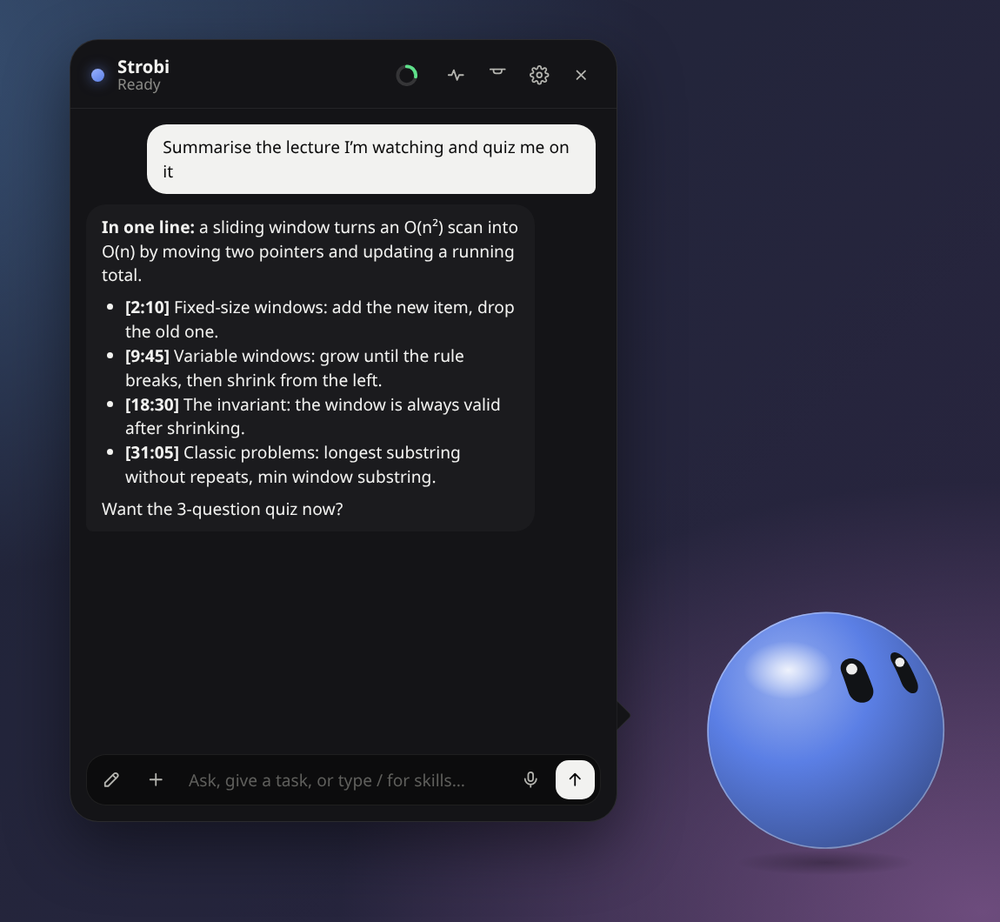
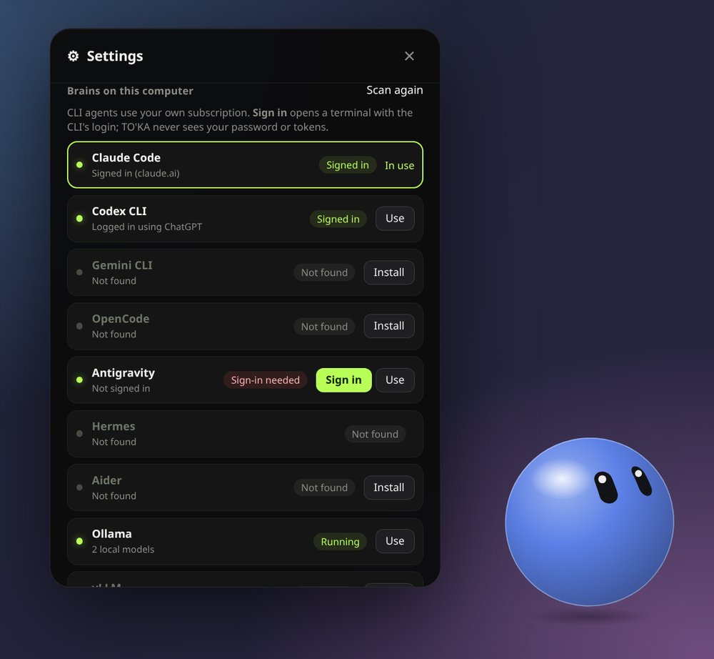
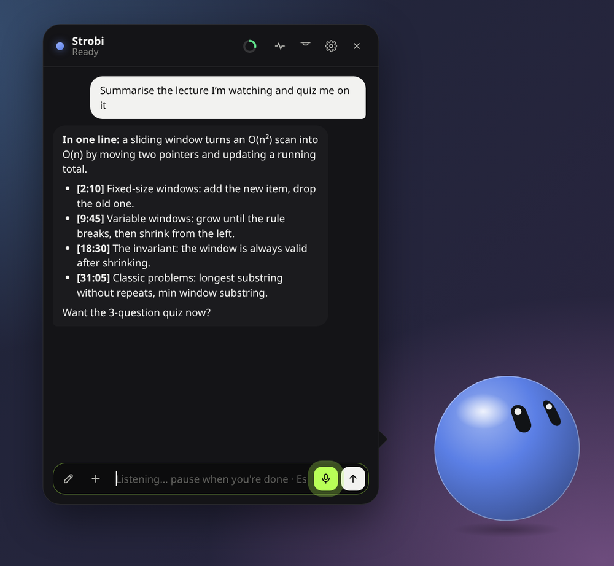
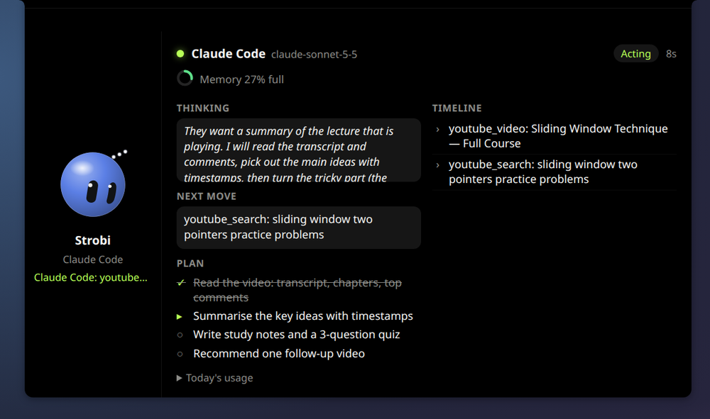

<p align="center">
  
</p>

<h1 align="center">TO'KA</h1>

<p align="center">
  <b>A desktop companion that does things for you.</b><br/>
  Talk or type. It browses, writes documents, summarises videos, plays your music, and never gets stuck when an AI runs out.
</p>

<p align="center">
  <a href="https://github.com/Itsmedexexplorer/TOKA/releases/latest/download/TOKA-windows-setup.exe"><b>⬇ Download for Windows</b></a>
  &nbsp;·&nbsp;
  <a href="#linux"><b>⬇ Install on Linux</b></a>
  &nbsp;·&nbsp;
  <a href="GUIDE.md">User guide</a>
</p>

<p align="center">
  
</p>

---

## Install

### Windows

1. Download **[TOKA-windows-setup.exe](https://github.com/Itsmedexexplorer/TOKA/releases/latest/download/TOKA-windows-setup.exe)**.
2. Double-click it. No admin rights needed.
   If you see *"Windows protected your PC"*, click **More info → Run anyway**.
3. TO'KA starts. Next time, open **TOKA** from the Start menu.

<details>
<summary>Prefer one command? (PowerShell)</summary>

```powershell
irm https://raw.githubusercontent.com/Itsmedexexplorer/TOKA/main/scripts/install.ps1 | iex
```
Run it again any time to update.
</details>

### Linux

Open a terminal (**Ctrl+Alt+T** on Ubuntu) and paste:

```bash
curl -fsSL https://raw.githubusercontent.com/Itsmedexexplorer/TOKA/main/scripts/install.sh | sh
```

That's it: it picks the right package for your system, asks for your password once, and adds **TOKA** to your app menu. Run it again any time to update.

<details>
<summary>Rather download a file?</summary>

| System | Download | Then |
|---|---|---|
| Ubuntu, Debian, Mint, Pop!_OS | [TOKA-linux-amd64.deb](https://github.com/Itsmedexexplorer/TOKA/releases/latest/download/TOKA-linux-amd64.deb) | Double-click it → **Install** |
| Fedora, openSUSE | [TOKA-linux-x86_64.rpm](https://github.com/Itsmedexexplorer/TOKA/releases/latest/download/TOKA-linux-x86_64.rpm) | Double-click it → **Install** |
| Any other | [TOKA-linux-amd64.AppImage](https://github.com/Itsmedexexplorer/TOKA/releases/latest/download/TOKA-linux-amd64.AppImage) | Right-click → Properties → *Allow executing*, then double-click |
</details>

**Needs:** Windows 10 or 11, or 64-bit Linux (Ubuntu 22.04 or newer, or similar).

---

## First steps

1. **Pick a brain.** Open **Settings → Brains on this computer**. TO'KA finds the AI tools you already have (Claude Code, Codex, Gemini CLI, Antigravity…). Click **Sign in** on one and log in with your usual account. No API key needed.
2. **Ask something.** Double-tap the character (or click the notch) and type, or click the 🎤 and just say it.
3. Optional: add the [browser extension](GUIDE.md#use-your-own-browser-the-toka-bridge-extension) so TO'KA can work in your own browser.

<p align="center">
  
</p>

---

## What it does

### 🎤 Talk to it

Press the mic or **Ctrl+Space**, speak, and pause. TO'KA turns your speech into text **on your computer** and sends it. Your voice is never uploaded.

<p align="center">
  
</p>

### 👀 See what it's thinking

The **Live** panel shows the AI's thinking, its plan as a checklist, its next move and every step it takes. The small ring fills up as the AI's memory fills: green, then amber, then red.

<p align="center">
  
</p>

### And more

| | |
|---|---|
| **Never gets stuck** | If one AI hits its limit, gets signed out or times out, TO'KA retries and then hands the task to the next one, conversation included. No questions asked. |
| **Videos** | *"Summarise the video I'm watching"* reads the transcript, chapters and top comments and gives you key points with timestamps. |
| **Music** | Learns what you like (kept on your computer) and plays it on YouTube Music, YouTube or Spotify. |
| **Study help** | Stuck on a topic? It explains step by step and finds good videos. |
| **Browser** | Opens sites, fills forms, clicks and reads pages, in its own window or your everyday browser. |
| **Documents** | Real Word, Excel and PDF files. |
| **Your desktop** | Opens apps and files, looks at the screen, types and clicks, asking first if you want it to. |
| **Two looks** | A floating character, or a black notch at the top of the screen. |

Everything is explained in the **[user guide](GUIDE.md)**.

---

## Privacy

- TO'KA runs on your computer. Your messages go only to the AI you pick.
- Voice is turned into text on your computer; audio is never saved or uploaded.
- Your settings, keys, memory and listening history stay in your own folder.
- You choose which actions need your OK first: commands, files, screen and keyboard, and risky clicks like buy or send.

## Help

Something not working? Check **[Troubleshooting](GUIDE.md#troubleshooting)**, or **[open an issue](https://github.com/Itsmedexexplorer/TOKA/issues)**.

## License

Free to download and use. The source code is private and all rights are reserved; see [LICENSE](LICENSE).
